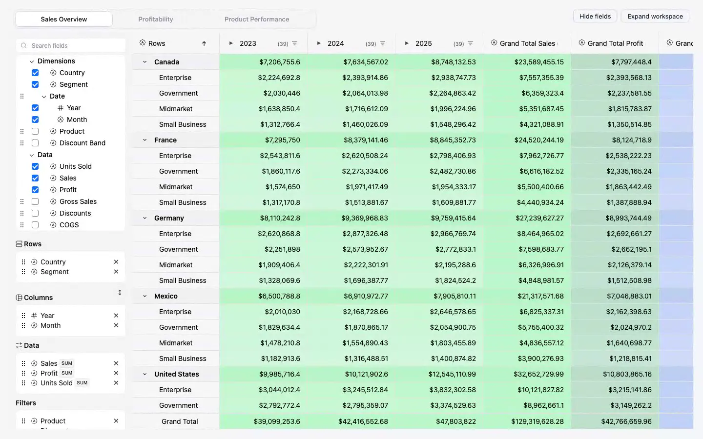
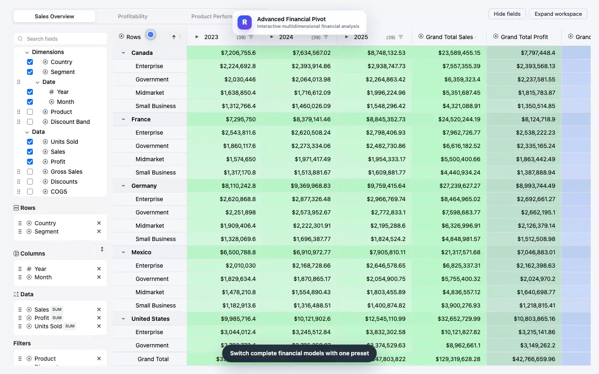
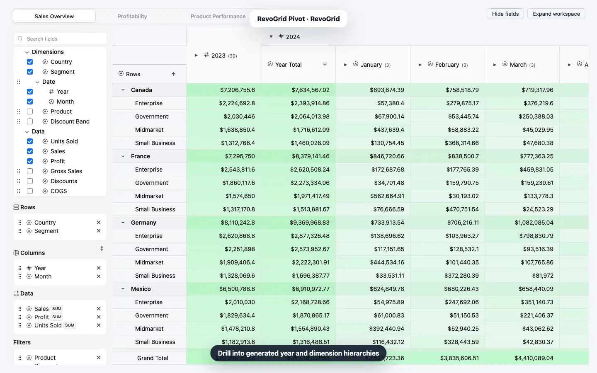
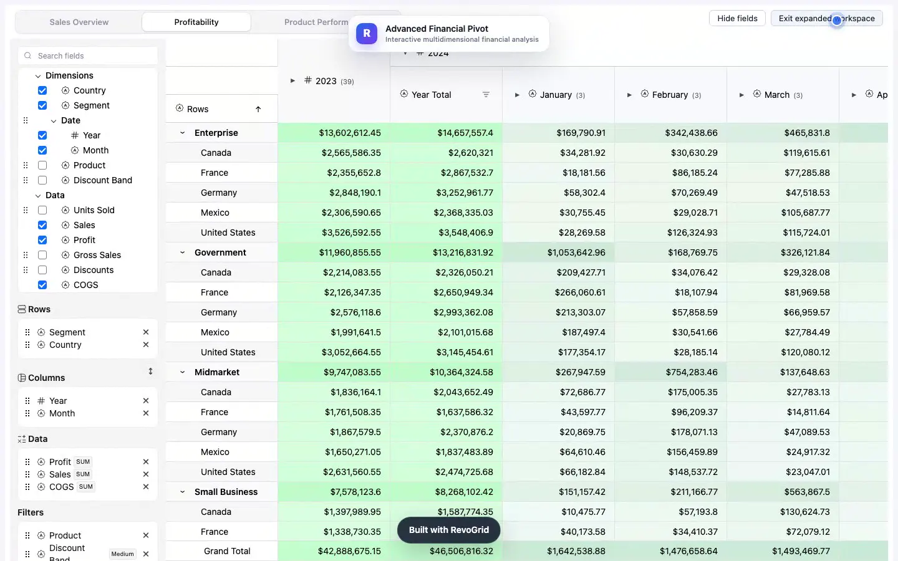

<div align="center">

# RevoGrid Pivot

**Multidimensional analytics embedded directly in your application.**

[](https://github.com/revolist/pivot/actions/workflows/ci.yml)
[](#framework-examples)
[](./LICENSE)

[View live demo](https://example.rv-grid.com/pivot/demo/) · [Request trial](https://pro.rv-grid.com/guides/installation-npm-trial/) · [Get Pro Advanced](https://rv-grid.com/pricing/)

[](./assets/pivot-walkthrough.mp4)

_Open the animation for the full-quality MP4 walkthrough._

</div>

This production-style financial analysis workspace combines RevoGrid Pivot and
Pro grid plugins across Vanilla TypeScript, React, Vue, and Angular.

## What it features

- Configurable row, column, value, and filter dimensions
- Sales, profitability, and product-performance presets
- Sum, average, minimum, and maximum aggregations
- Expand/collapse drill-down, parent-row aggregations, and grand totals
- Collapsible pivot column groups and multi-row headers
- Dimension sorting, text/number/selection filters, and header filter controls
- Currency, numeric, integer, and heatmap column types
- Linked Pivot charts created from the body-cell context menu
- Responsive configurator, preset controls, and expanded view

## Enterprise feature inventory

| Enterprise API | How this demo uses it and why it helps |
| --- | --- |
| `PivotPlugin` | Builds the pivot model and configurator, turns dimensions into row and column axes, supports drill-down, and produces parent-row aggregations and grand totals. This lets users reshape the same financial data without a new report. |
| `PivotChartsPlugin` | Projects the active Pivot result into renderer-neutral linked chart data. |
| `PivotChartsUiPlugin` | Adds the modeless chart dialog and contributes the Create chart action to the body-cell context menu. |
| `filterPivotSource` | Applies active pivot filter selections before modeling and expanding the initial row groups. |

The demo configures `PivotPlugin` with three reusable financial presets, sortable dimensions, selectable filters, expanded or collapsed row groups, column-group totals, and sum, average, minimum, or maximum value choices.

## Pro feature inventory

Every directly registered item below comes from `@revolist/revogrid-pro`.

| Pro plugin or API | How this demo uses it and why it helps |
| --- | --- |
| `AdvanceFilterPlugin` | Adds selection, text, and numeric filter choices to pivot dimensions so users can isolate a market, product, period, or value range. |
| `ColumnCollapsePlugin` | Collapses generated period or market column groups into aggregate placeholder columns, preserving useful totals while saving width. |
| `ContextMenuPlugin` | Hosts the Pivot Charts contribution so a chart can be created directly from a Pivot body cell. |
| `FilterHeaderPlugin` | Places filter controls in the generated headers so filtering stays close to the data being analyzed. |
| `MultiRowHeaderPlugin` | Renders the pivot's nested column groups as clear multi-level headers instead of a flat, ambiguous label row. |
| `RowOddPlugin` | Adds stable row striping hooks that improve readability across dense pivot output. |
| `RowSelectPlugin` | Enables checkbox-based row selection for workflows that need to act on selected pivot rows. |
| `SameValueMergePlugin` | Hides repeated adjacent row-axis labels, making Country, Segment, and Product groupings easier to scan. |
| `commonAggregators` | Supplies the standard sum, average, minimum, and maximum calculations used by the financial dimensions and presets. |
| `mergeCellProperties` | Composes heatmap styling with existing cell properties, so value intensity cues do not overwrite other pivot styling. |

`ColumnCollapsePlugin` automatically installs `ColumnGroupRenderSyncPlugin`. The companion keeps generated pivot-group header indexes correct as aggregate columns are collapsed or expanded; it does not need to be added to `FINANCIAL_SHOWCASE_PLUGINS`.

`SameValueMergePlugin` can automatically install `StickyCellsPlugin` for columns that opt into sticky same-value merging. This pivot uses normal same-value merging, so that optional companion is not installed here.

Currency, number, and integer formatting comes from `@revolist/revogrid-column-numeral`; the Pro heatmap column types add value-intensity coloring on top. Pivot requires an Enterprise entitlement, while the supporting grid features require Pro functionality.

## Recipes

| Recipe | What it demonstrates |
| --- | --- |
| [`basic-pivot.ts`](./recipes/basic-pivot.ts) | A compact rows, columns, values, and totals model. |
| [`fields-filters-totals.ts`](./recipes/fields-filters-totals.ts) | Runtime configurator, selection filters, subtotals, and grand totals. |
| [`charts-formatting.ts`](./recipes/charts-formatting.ts) | Linked charts and heatmap-backed column types. |

## Framework examples

| Framework | Entry point | Command |
| --- | --- | --- |
| Vanilla TypeScript | [`src/pivot.ts`](./src/pivot.ts) | `pnpm dev` |
| React | [`src/pivot.react.tsx`](./src/pivot.react.tsx) | `pnpm dev:react` |
| Vue 3 | [`src/pivot.vue`](./src/pivot.vue) | `pnpm dev:vue` |
| Angular | [`src/pivot.angular.ts`](./src/pivot.angular.ts) | `pnpm dev:angular` |

## Run it

```bash
pnpm install
pnpm dev          # Vanilla TypeScript
pnpm dev:react
pnpm dev:vue
pnpm dev:angular
```

Build variants use the matching `build:ts`, `build:react`, `build:vue`, and `build:angular` scripts.

Trial users must authenticate with the registry described in the [official
trial installation guide](https://pro.rv-grid.com/guides/installation-npm-trial/).
No registry token belongs in this repository. Licensed users can replace the two
trial aliases in `package.json` with the matching full Pro/Enterprise packages;
source imports remain unchanged.

## Workflow screenshots

| Overview | Primary workflow |
| --- | --- |
|  |  |
|  |  |

[Download the walkthrough poster](./assets/pivot-walkthrough-poster.webp).

## License

The examples, recipes, tests, documentation, and media tooling are MIT licensed.
RevoGrid Pro and Enterprise packages are separate commercial dependencies and
are not covered by this repository's MIT license.

## Main files

- `src/pivot.ts` — Vanilla TypeScript
- `src/pivot.react.tsx` — React
- `src/pivot.vue` — Vue
- `src/pivot.angular.ts` — Angular
- `src/financial.pivot.ts` — dimensions, presets, aggregations, and plugin configuration
- `src/financial-pivot-header/` — standalone report controls
- `src/financial-dataset.ts` — financial source data
